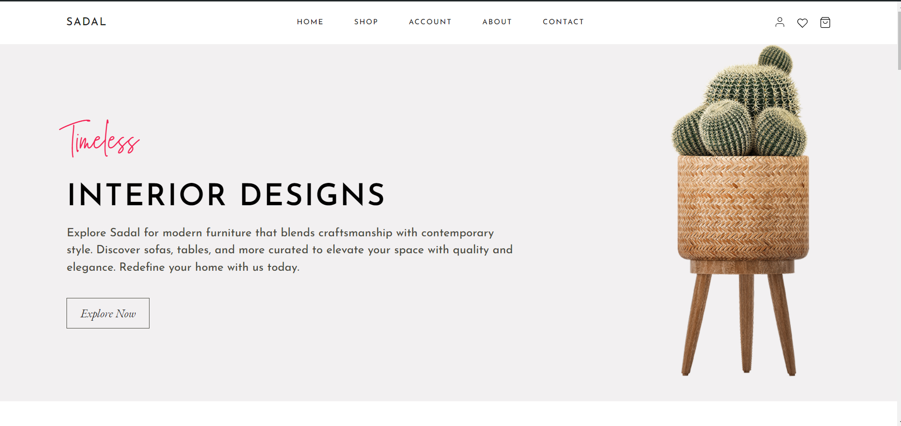

# Sadal

 

 Sadal is a simple and clean ecommerce theme built for a fictional furniture business.
 
 The project is built using HTML, CSS and Javascript.
 
 It contains the following pages which are:
 
 1. Homepage
 2. Shop
 3. Account
 4. About
 5. Contact

 And Individual Page For Each Product

 The about and contact pages are not yet built but yet to build.
 
 Link URL = https://github.com/Aristocratjnr/HCI
